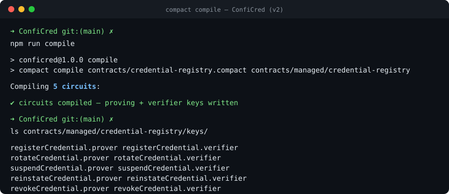
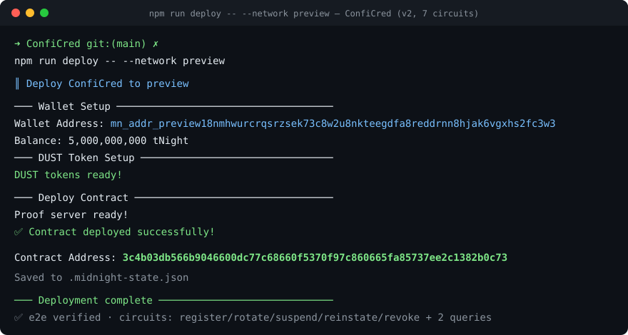
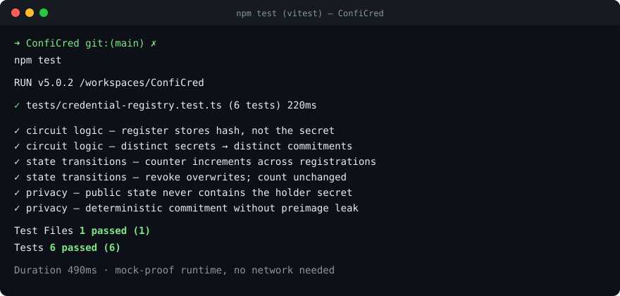
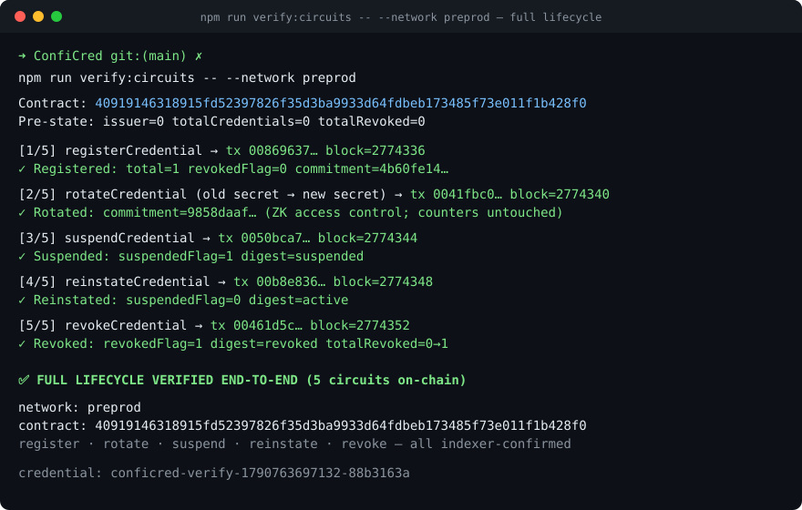

# ConfiCred

[](https://github.com/DevDDSmart/ConfiCred/actions/workflows/ci.yml)

> A zero-knowledge credential registry on Midnight: issuers register
> tamper-proof commitments to credentials; holders prove ownership without
> ever revealing their secret.

## Live Demo

**https://frontend-chi-sandy-60.vercel.app**

Open the URL, connect the **Lace** wallet extension (Midnight preprod
network), and register a credential — the proof is generated on your machine
inside the Lace wallet and only the commitment of your secret lands on-chain.

## Contract Address

| Network  | Address |
|----------|---------|
| Preview  | `3c4b03db566b9046600dc77c68660f5370f97c860665fa85737ee2c1382b0c73` |
| Preprod (live, used by the dApp) | `40919146318915fd52397826f35d3ba9933d64fdbeb173485f73e011f1b428f0` |
| Preprod (Level-1 registration, v1) | `41a259a5c805adfc15885a02498c98b04acafd95bb0b0575398cffbe631b9989` |

Both preprod addresses are deployments of **this project's contract**
(`contracts/credential-registry.compact`) made during Level 1:

- `41a259a5…` is the originally **registered Level-1 deployment** (v1 —
  `registerCredential` / `revokeCredential`). It was registered on Rise In
  before the contract was extended.
- `40919146…` is the **live v2 deployment of the current source** (5
  state-changing circuits: register / rotate / suspend / reinstate / revoke,
  6 ledger declarations) and is the exact address the deployed frontend
  calls (see `frontend/src/contract/registry.ts`).

A ZK contract deployment is pinned to the verifier keys generated at deploy
time, so the frontend must ship keys from the same compile as the deployment
it calls — it therefore targets the v2 deployment, which is a strict
superset of the v1 contract.

The full credential **lifecycle** (register → rotate → suspend → reinstate →
revoke) was executed on-chain against this deployment with every state
transition verified through the indexer — see `npm run verify:circuits`.
(Other redeploys of the same contract: preview
`b679d86221ed2893ffd6be94fef8aac1222ed592b2fdf43f9d70f260e206853e`. The
Step-3 hello-world deploy used for toolchain bring-up was
`1e30c98f91c424e406029a62f8a4bf73aa1c5c22ab702173e5ba3142bcde8c28` on preview.)

## What This Does

ConfiCred is a privacy-preserving credential registry **dApp** with a full
lifecycle. The frontend (`frontend/`, React + Vite) connects the Lace wallet,
calls the `registerCredential` circuit with **proof generation on the user's
machine inside the Lace wallet**, submits the transaction on-chain through
the wallet, and reads the
public registry state back from the indexer. The contract underneath supports
**rotation** (proving knowledge of the current secret — ZK access control),
**suspension / reinstatement** (temporary invalidation), and **terminal
revocation** with a public counter.
An issuer enrolls a credential by submitting the holder's *secret* (a 32-byte
value known only to the holder) through a ZK circuit; the chain stores only a
hash commitment under a publicly disclosed credential ID. The registry
supports **rotation** (the holder replaces their secret by proving knowledge
of the current one — ZK access control), **suspension / reinstatement**
(temporary invalidation, e.g. under investigation), and **terminal
revocation** with a public counter. Anyone can audit that a credential exists
and what state it is in — but nobody, not even the issuer's on-chain
footprint, can learn the holder's secret or forge ownership of a credential.

## Privacy Model

- **What is PUBLIC (on-chain, visible to anyone):**
  - `issuer` — the issuer ID of the registry
  - `totalCredentials` / `totalRevoked` — lifecycle counters
  - `credentials` — map from disclosed credential-ID (32-byte digest) to its
    owner *commitment* (a hash) or a status digest (`suspended` / `active` /
    `revoked`)
  - `revoked` / `suspended` — flat status-flag maps (1/0) per credential ID
- **What is PRIVATE (private witness, never on-chain):**
  - `holderSecret` — the credential holder's 32-byte secret, consumed only
    inside the ZK proof. It never appears in any ledger state or transaction
    payload.
  - `newHolderSecret` — the replacement secret during rotation.
- **What the user PROVES without revealing:**
  - That they know the `holderSecret` whose hash is the on-chain commitment —
    i.e. ownership of the credential — without disclosing the secret itself.
  - During **rotation**: that they know the *current* secret (the equality
    against the on-chain commitment is enforced inside the proof, so a wrong
    secret fails the transaction) and the hash of the replacement — revealing
    neither.

## Privacy Claim

**What an on-chain observer sees:** the credential ID (deliberately
disclosed), the *commitment* — a hash of the holder's secret — the lifecycle
counters, and the status flags. Transaction payloads contain only these
public values plus ZK proofs.

**What an on-chain observer cannot see:** the holder's secret itself — it is
a circuit witness consumed entirely inside the proof, which is generated on
the user's machine: the dApp hands the wallet the circuit's public key
material and Lace proves **inside the extension** (`dappConnectorProvingProvider`),
so no proof preimage leaves the device. (On an older Lace build without
proving delegation the dApp falls back to the public preprod proof server and
says so in the UI — the serialized preimage contains the witness in encrypted
circuit form, never as plaintext.) The secret is typed into the dApp as a
password field, never rendered back, never logged, never stored, and never
transmitted: in the UI it exists only in component memory (cleared
immediately after use), and on-chain only its hash is visible. An observer
cannot recover the secret from the commitment, cannot forge ownership of a
credential, and cannot link two credentials registered with different secrets
to the same holder. The unit test suite asserts the hiding property
mechanically: it serializes the entire public ledger state and asserts the
secret (string and hex) appears nowhere in it.

## Tech Stack

- **Midnight Network** (preprod; local devnet for development)
- **Compact** — Midnight's zero-knowledge contract language (compiler `0.5.3`)
- **Midnight.js SDK** (`@midnight-ntwrk/midnight-js` 4.1.1) + **DApp
  Connector API** (`@midnight-ntwrk/dapp-connector-api` 4.0.1) +
  **wallet-side proving** (`@midnight-ntwrk/midnight-js-dapp-connector-proof-provider`)
  — proofs are generated inside the Lace wallet on the user's machine
- **React 18 + Vite 5 + TypeScript** (frontend in `frontend/`)
- **Lace wallet** browser extension (Midnight preprod network)
- **Node.js** v22+ (tested on v24), **vitest**, **Docker + Compose**

## Prerequisites

- **Lace wallet** browser extension, set to the **Midnight preprod** network
  ([lace.io](https://lace.io/)), funded with tNIGHT from the
  [preprod faucet](https://midnight-tmnight-preprod.nethermind.dev)
- Node.js **v22 or newer** (`node --version`)
- Docker with Compose v2, running
- The **Compact toolchain**: the `compact` launcher ships as a standalone
  binary on the [official releases](https://github.com/midnightntwrk/compact/releases);
  it manages the actual compiler versions (`compact update <version>` — this
  project's CI pins the `0.31.1` compiler via the `compact-v0.5.3` launcher):
  ```bash
  curl -sSL https://github.com/midnightntwrk/compact/releases/download/compact-v0.5.3/compact-x86_64-unknown-linux-musl.tar.xz \
    | tar -xJ -C /tmp && sudo mv /tmp/compact-x86_64-unknown-linux-musl/compact /usr/local/bin/
  compact update 0.31.1
  ```
- For contract deploys: tNIGHT from the
  [preview](https://midnight-tmnight-preview.nethermind.dev) or
  [preprod](https://midnight-tmnight-preprod.nethermind.dev) faucet

## Setup

Requirements: Node 22+, Docker (with Compose v2), and the Compact toolchain.

> **On Windows:** the npm scripts in this project run natively (PowerShell or cmd.exe), but the Compact compiler publishes no native Windows binary — so `npm run compile`, and `npm run setup` which calls it, need to run inside WSL. See Midnight's [installation docs](https://docs.midnight.network/getting-started/installation).

```bash
npm install
npm run setup
npm run test:e2e
```

`npm run setup` runs end-to-end with no prompts:

1. `docker compose up -d --wait` — starts a local Midnight devnet (node, indexer, proof-server) and blocks until all three pass their healthchecks.
2. `npm run compile` — compiles the `.compact` contract in `contracts/` to `contracts/managed/`.
3. `npm run deploy` — on local devnet: derives the genesis-seed wallet (NIGHT pre-minted), registers UTXOs for DUST generation, deploys the contract, writes `.midnight-state.json`. On `preview`/`preprod`: generates a BIP-39 wallet on first use, waits for faucet funding, then deploys.

`npm run test:e2e` reconnects to the deployed contract and reads its ledger state. Exits 0 if the contract is live and indexable.

## Run Locally (frontend)

```bash
git clone https://github.com/DevDDSmart/ConfiCred.git
cd ConfiCred
npm install            # contract toolchain + backend scripts
cd frontend
npm install            # dApp dependencies
cp .env.example .env   # optional: override indexer / proof-server URLs
npm run dev            # http://localhost:5173
```

Then: install **Lace**, switch it to the **Midnight preprod** network, open
http://localhost:5173, click **Connect Lace**, and register a credential.
For a production build: `npm run build && npm run preview`.

Deployment to Vercel: see [DEPLOY.md](DEPLOY.md) (`cd frontend && vercel
--prod --yes`); `vercel.json` ships SPA rewrites and caching for the ZK
artifacts.

## Demo Video

<!-- PLACEHOLDER — add the link after recording -->

**Recording checklist (under 2 minutes):**

1. **Connect Lace** — show the wallet address appearing on screen after
   connecting (0:00–0:20).
2. **Call the circuit** — type a holder secret (masked), click *Register
   credential*, and show the **loading state** during local proof generation
   (0:20–1:00).
3. **On-chain result** — show the tx id / block height in the success panel,
   then refresh the *On-chain registry* read-back showing `totalCredentials`
   increment (1:00–1:30).
4. **Privacy point** — point out the secret was typed in a password field,
   never displayed anywhere, and that the chain only stores a commitment:
   highlight the *🔐 Proved without revealing your input* label and the
   registry showing only hashes (1:30–2:00).

## Run Tests

```bash
npm test            # 14 unit tests: circuit logic, lifecycle, privacy
npm run test:e2e    # live read-back against the deployed contract
npm run verify:circuits   # full register→rotate→suspend→reinstate→revoke on-chain round-trip
```

The unit suite runs the compiled contract on the local compact-runtime with
mock proofs — no network or proof server needed — and covers circuit logic,
the full credential lifecycle (including the wrong-secret rotation guard),
and that private inputs are never exposed in public state.

## Initial Idea

ConfiCred started from a simple question: *when someone shows you a
credential — a diploma, a license, a membership badge — why do you have to
call the issuer and trust whatever they say?* Traditional credential systems
centralize trust: the verifier phones home, the issuer's database becomes a
honey-pot of personal data, and the holder has zero control over who learns
what, when.

The idea: put the registry itself on a privacy-preserving ledger. The issuer
enrolls each credential once, on-chain, as a **commitment** — a hash of a
secret only the holder knows, bound to a publicly auditable credential ID.
From then on:

- **anyone can audit** that a credential exists and whether it's been revoked
  (the credential ID is deliberately disclosed via `disclose()`);
- **nobody can learn the holder's secret** — it is a private witness,
  consumed only inside the ZK proof, and never touches ledger state (the test
  suite asserts this literally by serializing the whole public state and
  searching it for the secret);
- **the holder proves ownership** of a credential without revealing anything
  about themselves beyond what they choose to show.

The result is a registry that is publicly verifiable but privately held —
trust anchored in cryptography instead of a phone call, with revocation that
is just as public as registration. Level 1 delivers the core registry
(compile → test → deploy to preview and preprod → verify every state
transition on-chain); future levels add the frontend where holders and
verifiers actually meet.

## Screenshots

### Compact compile — 5 circuits compiled, 10 key artifacts generated



### Deploy to preview — contract address



### Test suite — 14/14 passing (circuit logic, lifecycle, privacy)



### Full lifecycle verified on preprod — all 5 state-changing circuits on-chain



## Local devnet

The project ships its own devnet via `docker-compose.yml`:

| Service        | Port | Purpose                                         |
| -------------- | ---- | ----------------------------------------------- |
| `node`         | 9944 | Midnight node, `dev` chain preset               |
| `indexer`      | 8088 | GraphQL indexer for chain state                 |
| `proof-server` | 6300 | Generates ZK proofs for contract transactions   |

State lives in container-managed volumes. Tear everything down with:

```bash
docker compose down -v
```

That removes all containers, networks, and volumes. The next `npm run setup` starts from a clean slate.

## ⚠️ LOCAL DEVNET ONLY

The deploy script uses a well-known genesis seed (`0000…0001`) so the
pre-minted NIGHT in the `dev` chain preset is immediately available. **Do
not use this seed against Preprod, mainnet, or any environment that
handles real value** — anyone running this devnet has full access to
funds at this seed.

## Networks

This DApp supports three networks:

| Network | When to use | Default? |
|---|---|---|
| `undeployed` | Local devnet bundled in `docker-compose.yml`. Genesis seed is hardcoded; no funding needed. | yes |
| `preview` | Public preview testnet. Faucet at `https://midnight-tmnight-preview.nethermind.dev`. |  |
| `preprod` | Public preprod testnet. Faucet at `https://midnight-tmnight-preprod.nethermind.dev`. |  |

### Deployment wallet & faucets

| Network | Wallet address | Faucet |
|---|---|---|
| `preview` | `mn_addr_preview18nmhwurcrqsrzsek73c8w2u8nkteegdfa8reddrnn8hjak6vgxhs2fc3w3` | [midnight-tmnight-preview.nethermind.dev](https://midnight-tmnight-preview.nethermind.dev) |
| `preprod` | `mn_addr_preprod1kck3z2thjnlvsf8hj8qpsvejuf78c6yaxxwu0tza6ckx2tkfqvcqett2cv` | [midnight-tmnight-preprod.nethermind.dev](https://midnight-tmnight-preprod.nethermind.dev) |

- Both wallets were created on 2026-09-29. Only the addresses are public —
  their seeds and recovery phrases live in `.midnight-state.json`, which is
  gitignored. Never commit them anywhere.

The active network is **sticky**: whichever network you last interacted
with stays active until you switch. Any command run with `--network <name>`
also sets that network active for subsequent commands. The default on a
fresh project is `undeployed` (local devnet).

```sh
npm run setup -- --network preview   # runs on preview AND makes it active
npm run cli                          # still uses preview
npm run check-balance                # still uses preview
```

You can also switch without running anything else:

```sh
npm run network preview         # active network is now preview
npm run network                 # prints current active network
npm run network undeployed      # switch back to local devnet
```

### How wallets work across networks

- `undeployed` uses a hardcoded genesis seed. Local devnet pre-funds it.
- `preview` and `preprod` generate a fresh wallet on first use: a 24-word
  BIP-39 recovery phrase (printed once) plus its derived seed, both stored
  in `.midnight-state.json` (gitignored). The wallet survives switching
  networks — switch back later and your funded wallet returns.
- **Back up your recovery phrase** if you fund a public-network wallet you
  care about. It is printed when the wallet is created and kept in
  `.midnight-state.json` under `wallets.<network>.mnemonic`. Anyone holding
  the phrase controls the wallet.
- Wallets created before mnemonic support keep working from their stored
  `seed`; they just have no phrase to import into Lace.

### Using the same wallet as Lace

Seeds are derived with the standard BIP-39 `mnemonicToSeed` step — the same
convention Lace uses — so identity is portable in both directions:

- **Bring your Lace wallet here**: pass your recovery phrase via the
  `MIDNIGHT_WALLET_MNEMONIC` env var — the derived addresses match Lace.
  To keep the phrase out of your shell history, enter it with a hidden
  prompt instead of typing it inline:

  ```bash
  read -s MIDNIGHT_WALLET_MNEMONIC && export MIDNIGHT_WALLET_MNEMONIC
  npm run deploy
  ```
- **Take a scaffold wallet to Lace**: restore Lace from the 24-word phrase
  in `.midnight-state.json`.

### Funding a public-network wallet

On the first run with `--network preview` (or `preprod`):

1. `setup` will print your wallet address and the faucet URL.
2. Open the faucet URL, paste the address, request tNIGHT.
3. `setup` polls the wallet balance every 10 s and continues automatically
   once funds arrive.
4. The default poll budget is 10 minutes. Override with
   `MIDNIGHT_FAUCET_TIMEOUT_MS=1800000` (30 min) for unattended runs.

If the faucet is slow or the script times out, your seed is preserved.
Re-run `npm run setup -- --network preview` once the funds land.

> **First sync on public networks is slow.** A brand-new wallet syncing from
> genesis on `preview`/`preprod` can take 1–2+ hours (CPU-bound merkle-tree
> work, most of it even for an empty wallet). This happens exactly once per
> network: the wallet's synced state is cached in `.midnight-wallet-state/`
> and every later run resumes from it in seconds.

### Troubleshooting

- **`Invalid Transaction: Custom error: 171`** = `OutOfDustValidityWindow`
  (per the node's ledger error table). The transaction's dust-validity window
  was anchored to a stale sync tip. Re-run — the wallet re-syncs and re-anchors
  at the current tip (`npm run dust-register` retries this automatically).
- **`Custom error: 170`** = `InvalidDustSpendProof`; **173** =
  `InsufficientDustForRegistrationFee`; **192** = `InputsSignaturesLengthMismatch`
  (never double-sign a dust-registration recipe).
- **`expected instance of StateValue`** when calling circuits: two wasm
  instances of `@midnight-ntwrk/onchain-runtime-v3` in `node_modules` break
  `instanceof` checks between the compiled contract and the SDK. `package.json`
  pins a single shared copy via a root dependency + `overrides` — don't remove it.

### Environment overrides

These env vars override the active network's config (no per-network
suffix — they apply to whichever network is active for the run):

| Variable | Effect |
|---|---|
| `MIDNIGHT_WALLET_SEED` | Use this hex seed (32-128 hex chars; a Lace-compatible BIP-39 seed is 128) instead of generating/persisting one. Useful for CI with a pre-funded wallet. |
| `MIDNIGHT_WALLET_MNEMONIC` | Use this BIP-39 recovery phrase instead of generating a wallet — e.g. your Lace phrase, for the same addresses as Lace. Not persisted. Set only one of seed/mnemonic. |
| `MIDNIGHT_INDEXER_URL` | Override the indexer GraphQL URL. |
| `MIDNIGHT_INDEXER_WS_URL` | Override the indexer WS URL. |
| `MIDNIGHT_NODE_URL` | Override the node RPC URL. |
| `MIDNIGHT_FAUCET_URL` | Override the faucet URL printed during setup. |
| `MIDNIGHT_PROOF_SERVER_URL` | Override the proof server URL — set to a public proof server (e.g. `https://lace-proof-pub.preview.midnight.network`) to skip running one locally. |
| `MIDNIGHT_FAUCET_TIMEOUT_MS` | Faucet poll budget in milliseconds (default 600000 = 10 min). |

By default all networks use the **local** proof server. Public proof
servers exist (see the env override above) but the local default keeps
your witness data on your machine and avoids depending on a remote
service for the deploy hot path.

### Switching back to local devnet

```sh
npm run network undeployed     # or: npm run setup -- --network undeployed
```

Your preview/preprod wallet seeds and deploy addresses stay in
`.midnight-state.json`. Switch back later, and they're still there.

### Wallet sync cache

After each `deploy`, `cli`, or `check-balance` run, the scripts serialize the
wallet's synced state to `.midnight-wallet-state/<network>/` (gitignored).
The next run on the same network restores from that snapshot and only catches
up to the latest block instead of replaying from genesis — meaningful on
`preview` / `preprod` where a from-seed sync takes minutes.

If the cache is stale or corrupt (e.g. after an SDK upgrade with an
incompatible state format) the wallet falls back to a fresh from-seed sync
with a one-line warning. `npm run clean` removes the cache along with other
generated state.

## Available scripts

| Script                  | Description                                                    |
| ----------------------- | -------------------------------------------------------------- |
| `npm run setup`         | One-shot: start devnet, compile, deploy.                       |
| `npm run compile`       | Compile the Compact contract.                                  |
| `npm run deploy`        | Deploy the compiled contract (requires devnet up + compiled).  |
| `npm run cli`           | Interactive CLI to call circuits on the deployed contract.     |
| `npm run check-balance` | Print the wallet's NIGHT and DUST balances.                    |
| `npm run dust-register` | Register NIGHT UTXOs for DUST generation (with retries) — standalone, for when deploy's inline registration was rejected. |
| `npm run verify:circuits` | Exercise both circuits (register + revoke) against the deployed contract and verify each state transition via the indexer. |
| `npm run test:e2e`      | Smoke + read-back check against the deployed contract.         |
| `npm run clean`         | Remove `contracts/managed/`, `.midnight-state.json`, and `.midnight-wallet-state/`. |
| `npm run proof-server:start` / `:stop` | Compose lifecycle for just the proof-server service. |

## Project structure

```
ConfiCred/
├── contracts/
│   └── credential-registry.compact  # Compact source
├── contracts/managed/          # compiler output: circuits + proving keys (gitignored)
├── frontend/                   # Level 2 dApp (React + Vite + TypeScript)
│   ├── src/components/         #   WalletConnect.tsx, CircuitCall.tsx
│   ├── src/hooks/              #   useMidnight.ts (connector + providers)
│   ├── src/contract/           #   compiled artifact + registry wiring
│   ├── public/zk/              #   prover/verifier keys + ZKIR (served at /zk)
│   ├── vercel.json             #   SPA rewrites + artifact caching
│   └── vite.config.ts
├── scripts/
│   ├── e2e-check.ts            # smoke + read-back
│   └── dust-register.ts        # standalone DUST registration w/ retries
├── src/
│   ├── network.ts              # network selection + state file management
│   ├── wallet.ts               # wallet construction + sync-state cache
│   ├── setup.ts                # orchestrator for `npm run setup`
│   ├── deploy.ts               # deploy the contract
│   ├── cli.ts                  # interact with deployed contract
│   └── check-balance.ts        # NIGHT / DUST balance
├── tests/
│   └── credential-registry.test.ts  # circuit / state / privacy tests
├── .github/workflows/ci.yml    # CI: compile + typecheck + tests
├── docker-compose.yml          # node + indexer + proof-server
├── DEPLOY.md                   # frontend deployment guide
├── .midnight-state.json        # written by deploy (gitignored)
├── .midnight-wallet-state/     # serialized sync state per network (gitignored)
├── package.json
└── tsconfig.json
```

## Compact compiler version

This project was built with `compact 0.5.3`. To pin or upgrade your local
toolchain to a specific version:

```bash
compact update <version>
compact use <version>
```
